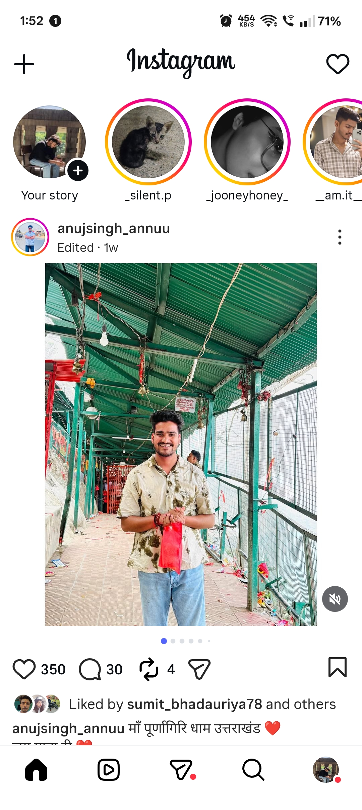
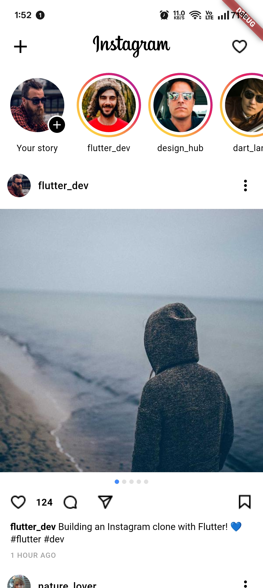

# Instagram Feed Clone 📸

A feature-rich, deeply customized Flutter application that meticulously replicates the core user interface, functionality, and feel of the Instagram Home Feed. This project was built focusing on performant UI rendering, robust state management, responsive interactions, and identical spatial and typographical replication of the original app.

---

## 🎥 Demo Video

> [Watch the demo](https://youtube.com/shorts/jooinD7309o?feature=share)

---

## 📱 Visual Comparison

A side-by-side comparison of this clone against the original Instagram application.

| **Original Instagram App** | **My App (Instagram Clone)** |
| :---: | :---: |
|  |  |

---

## 🏗️ Architecture & File Analysis

The project follows a clean architecture pattern with a clear separation of concerns, ensuring scalability and maintainability. Here is an analysis of the core directory structure and all the files involved:

### `/lib` Directory Anatomy

- **`main.dart`**: The entry point of the application. It initializes the `MultiProvider` to inject the `FeedProvider` into the widget tree and sets `HomeFeedScreen` as the starting view.

**1. `models/` (Data Structures)**
- **`post_model.dart`**: Defines the `Post` entity schema, including `postId`, `username`, `userAvatar`, a list of `imageUrls` (for carousels), `caption`, `likes`, `isLiked`, `isSaved`, and `timestamp`.
- **`user_model.dart`**: Represents the `User` entity, primarily defining properties like `username` and `avatar` used throughout the UI (e.g., stories tray and post headers).

**2. `providers/` (State Management)**
- **`feed_provider.dart`**: The core logic controller (using `ChangeNotifier`). It oversees the post feed state, handles lazy loading and pagination logic, and manages the interactive states of posts, such as toggling likes and saves. It communicates directly with the `PostRepository`.

**3. `screens/` (View Layer)**
- **`home_feed_screen.dart`**: The primary scaffold encompassing the entire UI. It orchestrates the `AppTopBar`, the `StoryList` tray, and hosts the infinitely scrolling `ListView` populated by `PostCard` widgets.

**4. `services/` (Data Fetching)**
- **`post_repository.dart`**: Acts as a mock data layer. It fakes network delay (1.5 seconds) to demonstrate asynchronous calls, returning mock JSON-like data with unique identifiers appended per page request to power the infinite scroll algorithm safely.

**5. `utils/` (Helper Classes)**
- **`snackbar_util.dart`**: A centralized utility to trigger consistent, branded, and user-friendly `ScaffoldMessenger` snackbars—especially to notify when a user interacts with currently unimplemented features (like sharing, commenting, or settings).

**6. `widgets/` (Reusable UI Components)**
- **`app_top_bar.dart`**: The localized app bar that displays the iconic Instagram text logo alongside notification and messaging icons.
- **`story_list.dart`** & **`story_avatar.dart`**: Renders the horizontal scrolling story tray at the top of the feed. Includes identical spacing, colorful gradient rings, and truncated username texts.
- **`post_card.dart`**: The aggregate container for a single post.
- **`post_header.dart`**: Displays the user's avatar, name, and the "more options" ellipsis.
- **`post_media.dart`**: Handles single image or multi-image carousels (`PageView`) using `cached_network_image`. Includes support for pinch-to-zoom concepts.
- **`post_actions.dart`**: Groups the Like (Heart), Comment, Share, and Save buttons with exact icon paddings and alignments.
- **`like_animation.dart`**: Controls the localized micro-interactions for double-tapping or interacting with the like button.
- **`post_caption.dart`**: Displays the username boldly beside the caption, truncating appropriately, and lists the timestamp.
- **`shimmer_post_card.dart`** & **`shimmer_story_list.dart`**: Beautiful skeletal loaders powered by the `shimmer` package, displayed while `post_repository` resolves mock network requests.

---

## 🚀 Development Journey (Todo List Analysis)

The project was methodically built utilizing a robust 20-phase checklist to guarantee that no interactive or visual detail of the original Instagram feed was missed. Here is a comprehensive overview of all the work done:

### ✅ Completed Milestones

1. **Phase 1 & 2: Requirements & Setup**
   - Assessed and extracted all visual requirements from the original app (colors, typography, spacing, scroll physics).
   - Generated the Flutter project and initialized the directory format.
   - Cleaned the default starter project completely.

2. **Phase 3 & 4: Architecture & Packages**
   - Built an MVVM-inspired folder hierarchy (`models`, `providers`, `services`, `widgets`, `screens`, `utils`).
   - Integrated necessary tools: `provider` (state), `cached_network_image` (media handling), `shimmer` (loading states), `flutter_svg` (vector icons), and `pinch_to_zoom_scrollable` (gesture support).

3. **Phase 5 & 6: Data Layer & Mocking**
   - Scripted robust Data Models supporting dynamic states (e.g., liked vs. unliked toggle structures).
   - Wrote a flawless `PostRepository` that mimics an actual REST API through artificially delayed Future responses and localized pagination IDs.

4. **Phase 7: State Management**
   - Implemented `FeedProvider` ensuring the UI strictly reacts to the data layer. Pagination, loading toggles, and interaction statuses are broadcasted immutably.

5. **Phase 8, 9, & 10: App Layout & Top Sections**
   - Engineered the main `HomeFeedScreen` with custom smooth scroll physics.
   - Designed the `AppTopBar` checking off correct icon weight, safe areas, and alignment.
   - Built the Stories Tray utilizing dynamic gradients and custom `StoryAvatar` scaling identical to Instagram's.

6. **Phase 11 & 12: Complex Post Layouts & Carousels**
   - Deconstructed the post into 4 main chunks: Header, Media, Actions, Caption.
   - Integrated a flawless `PageView` carousel for posts holding multiple images with a sleek indicator dot mechanism that responds to horizontal swiping.

7. **Phase 14 & 15: Stateful Interactions & Snackbars**
   - Built a dynamic Like button (animated heart) and Save bookmark system that remembers state even when scrolled out of memory.
   - Plumbed all unassigned buttons (Notifications, Media Upload, More Options) to a uniform `SnackbarUtil` to elegantly provide feedback to users evaluating the app interactively.

8. **Phase 16 & 17: Edge Cases, Shimmer & Caching**
   - Introduced a robust `cached_network_image` strategy with graceful fallbacks and error widgets.
   - Developed `ShimmerPostCard` to prevent jarring pop-ins on load.

9. **Phase 18 & 19: Infinite Scroll & Pagination**
   - Hooked up a `ScrollController` listener to detect when a user is 2 posts away from the feed's bottom, seamlessly triggering the `FeedProvider` to fetch extended mock data, showing a discrete bottom loading spinner.

10. **Phase 20: Performance Optimization**
   - Optimized rendering throughput by leaning heavily into `const` widget constructors, lazy-rendering lists (`ListView.builder`), utilizing `RepaintBoundary` where needed, and isolating widget rebuilds.

---

## 🛠️ Tech Stack & Packages Used

* **Framework:** Flutter (Dart)
* **SDK Version:** `^3.9.2`
* **State Management:** Provider (`^6.1.5+1`)
* **Network Image & Cache:** `cached_network_image` (`^3.4.1`)
* **Loading Effects:** `shimmer` (`^3.0.0`)
* **Assets Rendering:** `flutter_svg` (`^2.2.4`)
* **System Icons:** `cupertino_icons` (`^1.0.8`)
* **Gestures:** `pinch_to_zoom_scrollable` (`^0.1.2`)
* **Data Parsing/Formatting:** `intl` (`^0.20.2`)

---

*Enjoy the polished, pixel-perfect clone! 🚀*
